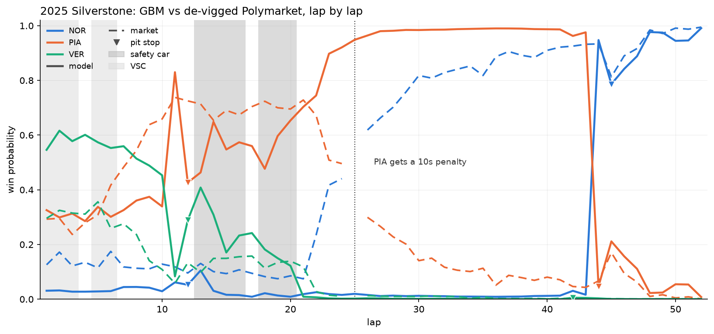
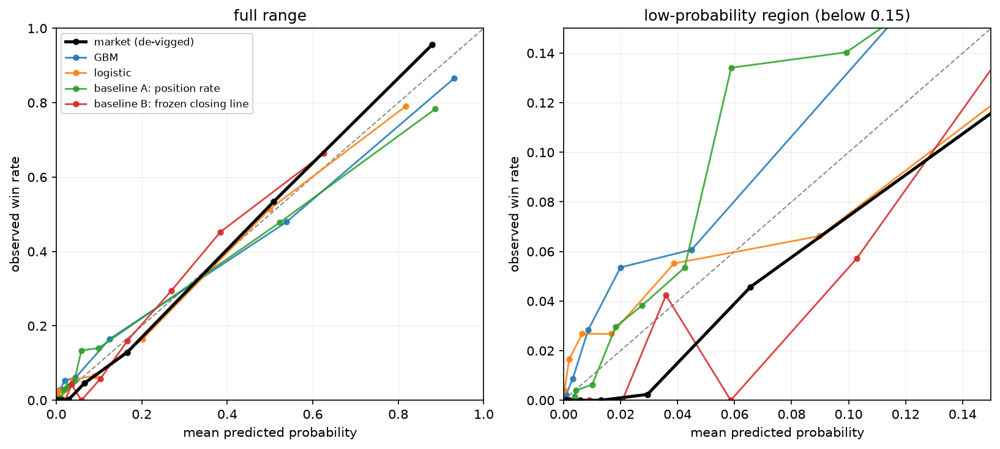

# Fair Lap

A lap-by-lap F1 win probability model built from live timing data, tested
against Polymarket's in-race betting odds to see which one is better calibrated.



*2025 British GP. Solid lines are the model, dashed lines are the de-vigged
Polymarket price. Race control flags a safety car incident involving Piastri on
lap 22 and the stewards give him a 10 second penalty on lap 25. The market
starts moving to Norris as soon as the incident is flagged and has him as the
favourite by lap 26. The model only sees positions, gaps, tyres and flags, so it
keeps Piastri at 0.99 until he serves the penalty at his stop on lap 44. I
picked this race because it shows the mid-race problem clearly. It's one of the
model's worse races, and over the full set the GBM actually beats the market in
15 of 36 races.*

## Result

Across 36 races and 12,688 lap-level predictions, Polymarket's in-race odds
are better calibrated than the model (Brier 0.042 vs 0.065; race-clustered 95%
CI on the gap 0.008 to 0.040). In the opening 10 laps the model and market are
statistically indistinguishable. The model loses mid-race, where the market is
pricing in information that isn't in the lap timing data the model sees.

| Laps | rows | races | GBM Brier | market Brier | 95% CI on the gap | Verdict |
|---|---|---|---|---|---|---|
| all | 12,688 | 36 | 0.0654 | 0.0423 | +0.0076 to +0.0401 | market |
| opening (1-10) | 2,668 | 35 | 0.0636 | 0.0657 | -0.0175 to +0.0144 | tie |
| middle | 8,499 | 36 | 0.0737 | 0.0414 | +0.0145 to +0.0531 | market |
| closing (final 10) | 1,521 | 34 | 0.0222 | 0.0063 | -0.0045 to +0.0381 | tie |

The model is trained on 2023-24 and scored once on the held-out 2025-26
seasons. I tested the two obvious explanations for the mid-race gap, pit stop
timing and driver/team identity, and neither one holds up
([details below](#what-doesnt-explain-the-gap)).

- [How the eval set was constructed and what it excludes](docs/methodology.md)
- The leakage rules are enforced as tests in
  [`tests/test_leakage.py`](tests/test_leakage.py)

## Setup

Every row is a `(race, lap, driver)`: at the end of each lap, what's each
driver's probability of winning? Scoring every lap instead of just "did it pick
the winner" gives thousands of predictions instead of about 8 held-out races.
Laps within a race are strongly correlated though, so every confidence interval
here resamples whole races, not rows.

Four forecasters are compared against the market:

| Model | What it knows |
|---|---|
| baseline A (`position_rate`) | historical win rate by position and how far into the race it is |
| baseline B (`frozen_prerace`) | the market's de-vigged closing line before the start, held flat |
| `logistic` | position, gaps, pace, tyres, stops, SC/VSC/red flag, linear |
| `gbm` | same features, shallow LightGBM |

Market prices come from a strictly backward as-of join with a 5 minute
staleness limit. If a driver's market had no fill in the 5 minutes before the
lap ended, that row isn't scored. Prices are de-vigged before any comparison.

## Results in detail

Reproduce with `make eval`. Everything is committed under
[`data/eval_*.csv`](data/).

| | Brier | log loss | vs. market | 95% CI (races resampled) | |
|---|---|---|---|---|---|
| **market** (de-vigged) | **0.0423** | **0.1499** | | | |
| GBM | 0.0654 | 0.2335 | +0.0232 | +0.0076 to +0.0401 | market wins |
| logistic | 0.0717 | 0.2569 | +0.0294 | +0.0174 to +0.0424 | market wins |
| baseline A (position rate) | 0.0754 | 0.2617 | +0.0331 | +0.0182 to +0.0490 | market wins |
| baseline B (frozen closing line) | 0.0893 | 0.2874 | +0.0471 | +0.0323 to +0.0632 | market wins |

Lower is better, so a positive difference means the model loses. The GBM does
beat both baselines, including the frozen pre-race line, so live timing data
adds something the closing line didn't have. The live market just has more.

### Where each side wins

| Breakdown | Group | rows | races | GBM - market Brier | 95% CI | Verdict |
|---|---|---|---|---|---|---|
| phase | opening (laps 1-10) | 2,668 | 35 | -0.0022 | -0.0175 to +0.0144 | tie |
| phase | middle | 8,499 | 36 | +0.0324 | +0.0145 to +0.0531 | **market** |
| phase | closing (final 10) | 1,521 | 34 | +0.0160 | -0.0045 to +0.0381 | tie |
| condition | green | 11,533 | 36 | +0.0208 | +0.0054 to +0.0374 | **market** |
| condition | SC / VSC / red | 1,155 | 29 | +0.0471 | -0.0072 to +0.0940 | tie |
| season | 2025 | 8,156 | 24 | +0.0245 | +0.0061 to +0.0460 | **market** |
| season | 2026 | 4,532 | 12 | +0.0208 | -0.0063 to +0.0516 | tie |

All of the measurable gap is in the middle of the race under green flags. In
the first ten laps the GBM's point estimate is actually slightly ahead, which
makes sense since both sides are mostly just reading the grid. Under safety cars
and in 2026 the intervals are too wide to call, but that's because of sample
size (1,155 rows over 29 races, and 12 races) and doesn't mean they're equal.

### How the model loses

The model loses to the market in the middle of green-flag running (Brier
0.0737 vs 0.0414, difference +0.0324, 95% CI +0.0145 to +0.0531, 8,499 rows in
36 races) because it writes off drivers who go on to win and the market doesn't.
It isn't a uniform handicap. The GBM is ahead in 15 of 36 races and the median
per-race difference is only +0.003. The average is dragged up by a tail of races
where the car in front isn't the car that ends up winning.

That's a description of how it fails, not why. The first "why" I tried turned
out to be wrong (next section).

One diagnostic, which conditions on the outcome and so can only explain the
result and never be the result: split the rows on whether the eventual winner
was already leading on that lap. When they were (8,697 rows), the model beats
the market, 0.0094 vs 0.0231 (CI -0.0213 to -0.0075). When they weren't (3,991
rows), it loses badly, 0.1877 vs 0.0840 (CI +0.069 to +0.145), putting 0.17 on
the eventual winner while the market puts 0.48. A model built on track position
is basically guaranteed to look good on the first half of that split, so the
useful part is where the losses come from. The five worst races are all ones
where the winner came from behind (Monza 2026 won from P19, Jeddah 2025, Lusail
2025, Silverstone 2025), and the races the model wins are the lights-to-flag
ones.

### What doesn't explain the gap

#### Pit intent

The obvious guess was that the market is pricing an undercut that's about to
happen. `expected_remaining_stops` is a per-circuit prior, not the driver's
actual plan, so the model can't see a stop coming.

To test it I gave the GBM a feature it could never have in real life: whether
this driver pits in the next N laps, and how many of the current top 5 do. Any
real pit-intent feature, however it's built, can't do better than perfect
knowledge of the future, so this is an upper bound.

| | Brier | vs. plain GBM |
|---|---|---|
| GBM | 0.0694 | |
| + perfect pit oracle, 2-lap window | 0.0699 | +0.0005 |
| + perfect pit oracle, 3-lap | 0.0697 | +0.0004 |
| + perfect pit oracle, 5-lap | 0.0686 | **-0.0008** |
| market | 0.0618 | -0.0076 |

Perfect foreknowledge closes about 10% of the gap, with a 95% CI of -0.0035 to
+0.0015, so it's indistinguishable from zero. The reason is simple: across
51,108 training rows the win rate is 5.5% for drivers not about to pit and 4.9%
for drivers who are. Almost everyone stops, so knowing who stops next barely
tells you who wins.

I checked the oracle actually worked before trusting the null. It flags 9.2% of
rows, `P(stint change within 3 laps | oracle = 1) = 0.68` vs `0.033` when it's
0, and its highest correlation with any existing feature is 0.18, so it's
informative and not redundant.

This ran on 2023-24 with `GroupKFold`, so the held-out seasons weren't touched.
Reproduce with `uv run python experiments/oracle_pit_bound.py`. Two caveats:
the matching row set is only 2,185 rows over 10 races of 2024, the weak market
season, where the gap is +0.0076 instead of +0.0231; and the oracle only covers
pit timing, not tyre choice or the decision to go long.

#### Driver and team identity

The GBM has no idea who's driving. It can't tell that the car in P3 is a Red
Bull with Verstappen in it, and the market obviously prices that. Identity is
known before the race starts, so it's a legal feature, and `raw_drivers` was
already ingested.

It makes the model significantly worse.

| | Brier | vs. plain GBM | 95% CI |
|---|---|---|---|
| GBM | 0.0694 | | |
| + team | 0.0848 | +0.0155 | +0.0038 to +0.0390 |
| + driver | 0.1072 | **+0.0378** | +0.0127 to +0.0774 |
| + both | 0.1082 | +0.0389 | +0.0119 to +0.0853 |
| market | 0.0618 | -0.0076 | |

The intervals exclude zero, so it's not noise. Adding driver identity makes the
gap to the market about five times wider. The model does use the feature
(9.9% of gain importance), it just gets worse with it.

Verstappen won 28 of the 46 training races. Identity helped in the races he won
and hurt in every race he didn't, most of all in races won by rare winners. The
correlation between the winner's share of training races and the Brier change
is -0.692.

| | winner | winner's share of races | Brier change |
|---|---|---|---|
| helped most | VER | 0.61 | -0.029 |
| hurt most | PIA | 0.04 | +0.046 |
| | PER | 0.04 | +0.070 |

Identity is constant across a whole race, so when it's wrong it's wrong for
around 350 laps, and Brier punishes confident mistakes quadratically. Eighteen
races of being confidently wrong cost more than 28 races of being slightly more
right gained.

Reproduce with `uv run python experiments/identity_test.py`. Same setup as the
oracle: 2023-24 only, `GroupKFold` by race. Identity goes in as a LightGBM
categorical and not a precomputed win rate, because a win-rate prior would have
to be refit inside every fold or it leaks held-out outcomes.

#### What's left

Pit intent is bounded at about 10% of the gap. Identity makes things worse. And
baseline B, which is basically identity as a frozen prior, is the worst
forecaster in the table at 0.0893.

My current guess is that the market's edge isn't one missing feature. The
market holds a strong prior and moves off it when the race goes differently,
and it does that better than either piece of this project: baseline B has the
prior but can't update, and the GBM updates but has a weak prior. That's a
hypothesis, not a result. The way to test it is a model that carries a prior it
can update away from.

The Silverstone chart at the top points at another thing: the market reacted to
a steward penalty and the model has no way to see penalties. `raw_race_control`
is already ingested and penalty messages are timestamped, so a penalty feature
would be legal. That's one race though, and I haven't measured it across the
test set.

### Calibration

Ten quantile bins, because win probabilities pile up near zero and equal-width
bins leave the top bucket with only a few rows.

| | expected calibration error |
|---|---|
| market | 0.0209 |
| GBM | 0.0244 |
| logistic | **0.0172** |
| baseline A | 0.0305 |
| baseline B | 0.0280 |

The logistic model has the lowest calibration error, not the market. (An
earlier version of this table had those two swapped because `make eval` printed
the column without names and I read the rows in the wrong order.) This doesn't
change the headline, which is scored on Brier, and ECE is a weak summary here
anyway since it hides which direction a forecaster is off in. The logistic
model gets close to the diagonal by not being very sharp: its top decile
predicts 0.817 vs the market's 0.879. Brier rewards sharpness too and still
ranks it third.



Two panels because eight of the ten bins are below 0.15, and on a full axis they
all collapse onto the origin. The right panel is where the result is.

The market stays at or below the diagonal in the low range, and so does
baseline B (the market's own pre-race opinion) for the most part. Every fitted
model sits above it. The market's bottom five deciles, 6,344 rows, contain zero
winners: when the market writes a driver off, that driver never wins in this
sample. The GBM and baseline A observe 2.8 to 6.1% win rates where they
predicted 0.1 to 2%. They write off drivers they shouldn't.

At the top end the GBM is overconfident. Its top decile predicts 0.931 and
observes 0.866, while the market predicts 0.879 and observes 0.956, so the
market errs on the safe side.

Regenerate with `make eval`
([`data/eval_calibration.csv`](data/eval_calibration.csv)).

### Betting backtest (sanity check only)

| | bets | races | staked | PnL | ROI | 95% CI |
|---|---|---|---|---|---|---|
| all | 5,075 | 36 | 2,663.81 | +257.19 | +9.7% | +1.9% to +17.1% |
| 2025 | 3,198 | 24 | 1,704.92 | +170.08 | +10.0% | +2.9% to +15.8% |
| 2026 | 1,877 | 12 | 958.88 | +87.12 | +9.1% | -7.5% to +28.1% |

Flat one-unit bets on every row where the GBM disagrees with the de-vigged price
by more than 3 points, bought at the quoted price (`p_market * overround`) plus
a 1 point spread. Betting at the de-vigged probability would mean getting better
odds than the market actually offered.

This makes money while losing on calibration, and I don't think it means
anything. 5,075 bets over 36 races aren't 5,075 independent bets (dozens of bets
on one race are really one bet on that race), it assumes any size fills at the
quoted price, and a real order book would have moved. The 2026 interval already
crosses zero. The Brier result is the result.

### What it would take for the model to win

Not pit intent and not identity, per above. What's left:

- A model with an updatable prior. Needs no new data.
- A penalty feature from `raw_race_control`. Data is already there.
- Separating clean-air pace from pace in traffic, which needs OpenF1's
  `car_data` and `location` endpoints that this project doesn't ingest.

None of these is free, since the held-out seasons have now been looked at once.
Another round of features means the 2025-26 score has some hindsight in it, and
tuning the GBM against that set would get a better number and a worse project.

## Replay and dashboard

`make replay SESSION_KEY=...` re-runs a finished race one lap at a time. At lap
*t* it rebuilds every feature from history cut off at the end of lap *t*, using
the same functions as the feature table, and asks a fitted model for everyone's
win probability. The model is fitted on 2023-24 with the replayed race left out.
`tests/test_replay.py` checks that replaying Melbourne 2025 reproduces all 928
scored holdout predictions with a maximum difference of 0.0.

Replay output goes to `replay_predictions`, not `predictions`, since
`predictions` holds the rows the results are scored on. It's written in one
upsert at the end instead of lap by lap, because DuckDB allows one writer or
many readers on a file and a replay holding the write lock would block the
dashboard.

`make dashboard` is read-only and doesn't compute any statistics itself. It
reads `replay_predictions` and the `eval_*` tables, so the charts match the
numbers above. Four tabs: model vs market over laps with SC/VSC/red flag laps
shaded, calibration curves, the breakdown table with CIs, and per-race coverage.

The full database is about 50MB and gitignored, so the repo also commits
`data/dashboard.duckdb` (4.2MB), a copy of just the tables and columns the
dashboard reads. `make dashboard-db` rebuilds it: it replays all 38 held-out
races that have a market (about 2 minutes) and then copies the eval tables, the
replays, sessions, drivers, and a trimmed slice of the feature table. The
dashboard uses the full database if it exists and the snapshot if it doesn't,
so a fresh clone can run `make install && make dashboard` without running
the ingest. The replayed rows match the scored holdout predictions on all
42,523 rows, max difference 0.0.

The hosted version reads the same snapshot. `dashboard/requirements.txt` is
what Streamlit Community Cloud installs, and it's only the four packages the
dashboard imports, not the modelling stack.

`make race-chart SESSION_KEY=...` draws the chart at the top of this page for
any 2025-26 race.

## Quickstart

```
make install
make coverage-scan
make ingest
make features
make predict
make eval
make replay SESSION_KEY=9693
make race-chart SESSION_KEY=9947
make dashboard-db
make dashboard
```

To just look at the dashboard on a fresh clone, `make install` and
`make dashboard` are enough.
